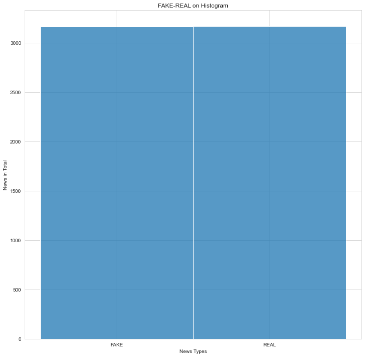

# Fake News Detection with PAC and XGBoost

## Problem Statement

In this project, it has been tried to guess whether the news is fake or real based on title and content.

## Dataset

Dataset has **4 columns** and **7795 rows without the header**.

| Column | Details |
|--|--|
| title  | title of the news |
| text | news |
| label | Is the news fake or real? |

## Methodology

In this project, as stated in the title, results were obtained through **PAC** and **XGBoost**.

## Analysis

| # | Column | Non-Null Count | Dtype |
|--|--|--|--|
| 0 | Unnamed: 0 | 6335 non-null | int32
| 1 | title | 6335 non-null | object
| 2 | text | 6335 non-null | object
| 3 | label | 6335 non-null | object

dtypes: int64(1), object(3)

### Numbers of News in Overall

     

 - REAL                  3171

 - FAKE			      3164

#### Confusion Matrix of PAC (Passive Aggressive Classifier)

| 592 | 46 |
|--|--|
| **43** | **586** |

**Accuracy score: 0.9297553275453828 %**

### XGBoost

#### Confusion Matrix of XGBoost

| 576 | 50 |
|--|--|
| **62** | **579** |

**Accuracy score(XGBoost): 0.9116022099447514**

Process took 14.131280899047852 seconds.

## How to Run Code

Before running the code make sure that you have these libraries:

 - pandas 
 - time
 - sklearn
 - seaborn
 - xgboost
 - matplotlib
    
## Contact Me

If you have something to say to me please contact me: 

 - Twitter: [Doguilmak](https://twitter.com/Doguilmak)  
 - Mail address: doguilmak@gmail.com
 
